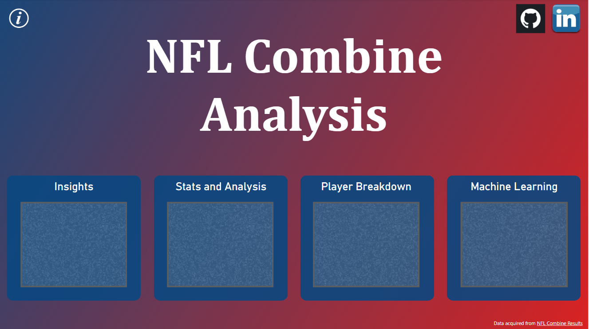
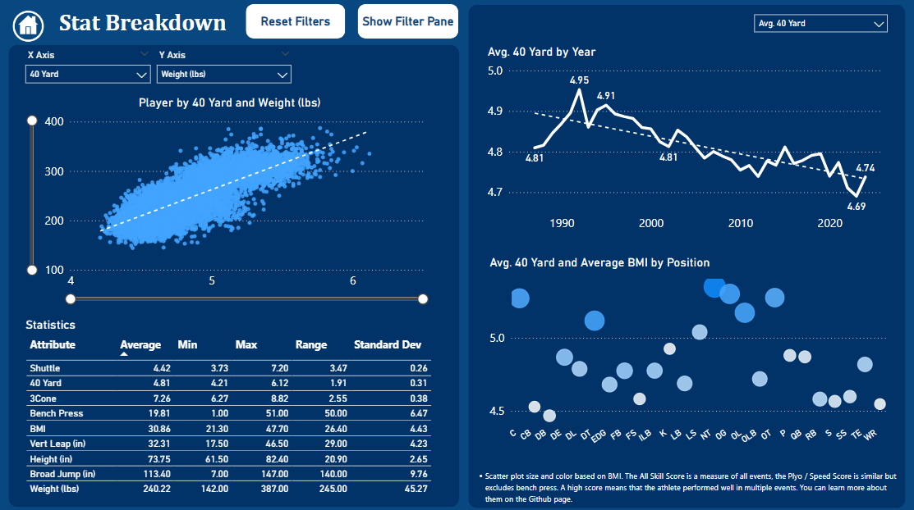
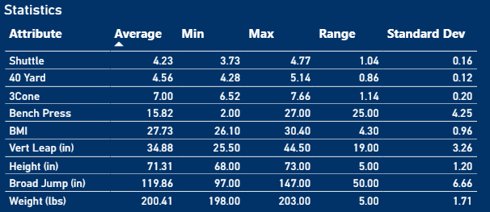
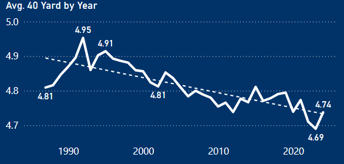
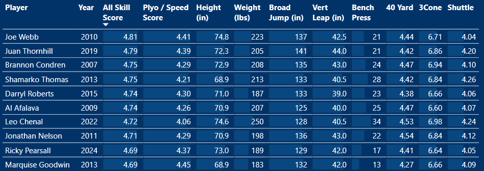
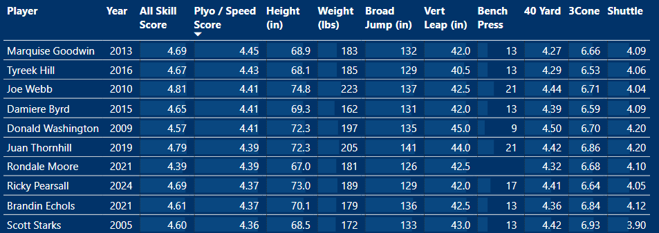
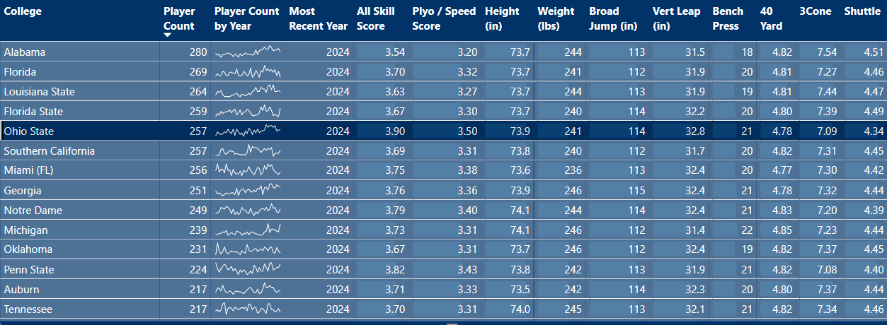
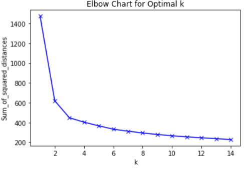
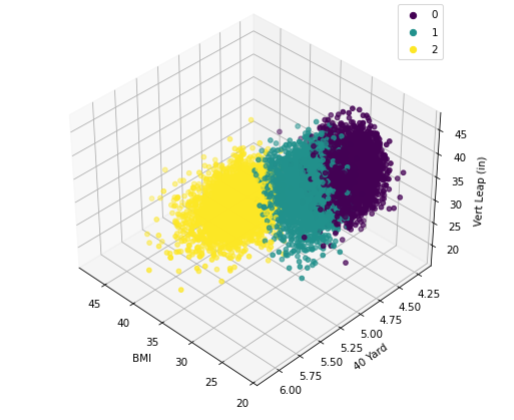
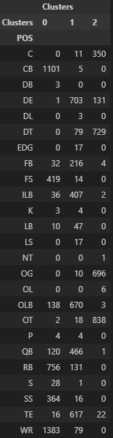

# NFL Combine Analysis and Machine Learning
[Link to Dashboard](https://scary62.pythonanywhere.com/001Combine.html)!

##### Dashboard Front Page

##### Stat and Analysis Page View

## Introduction:
This project was developed to help athletes assess their potential performance in the NFL Combine based on their size. The project involved scraping NFL Combine data spanning from 1987 to 2024 using BeautifulSoup and Python. The data was  then cleaned and processed to extract valuable insights, which were visualized dynamically using PowerBI.

Supervised and unsupervised machine learning techniques were used to predict player results in the 40 yard dash and classify players based on their statistics. The result of 40 yard dash predictions have been added to the PowerBI dashboard so that athletes can get an estimate of their 40 yard performance.

## Data Collection and Cleaning:
Using web scraping techniques, the project retrieved comprehensive NFL Combine data, including various performance metrics, from the specified time range. BeautifulSoup was used to extract the necessary information from the source. Subsequently, Python was utilized to clean and preprocess the data, as well restructured in a way to find additional insights.

## Insights and Analysis:

#### Athlete Size and 40 Yard Dash Time:
As a demonstration, I found statistics for atheletes in a similar size range to me. This included athletes with a height range of 71-73" and weight range of 198-203lbs. The analysis revealed a minimum 40 yard dash time of 4.28s, an average of 4.56s, and a maximum of 5.14s.

#### Trends:
Comparing data from 1987 to the present, it was observed that the average 40 Yard dash time has decreased by 1.5%, indicating an overall improvement in athletic performance over time.

**Added Metrics - Two additional metrics were created using performance in the events; the All Skill Score and the Plyo / Speed Score. The All Skill Score measures performance across all categories. It was created by scaling all results to a number between 0 and 1, where 0 was the worst performance and 1 was the top performance in the event. The scores were added together to get the All Skill Score. The Plyo / Speed Score is the same, except that the Bench Press is taken out. In order to be considered for these categories, the athlete had to have competed in all events.

#### Top Performers:
Joe Webb from UAB had the highest All Skill Score, with an impressive 21 reps on Bench Press and exceptional results in the speed / plyo events.

#### Plyo/Speed Score:
Marquise Goodwin achieved the highest Plyo / Speed Score, being one of the best performers in all of the speed and plyo events.

#### School Performance:
Analyzing larger schools with over 200 participating players, Ohio State emerged as the dominant institution across most events, except for the bench press (led by Michigan) and the 40 Yard dash (led by Miami).

#### Correlations:
Positive correlations were observed between high scores on the 3 Cone, Shuttle, Broad Jump, Vertical Leap, and Shuttle drills with faster 40 Yard Dash times. Conversely, higher numbers in Bench Press, Weight, and Height were associated with slower 40 Yard times. However, noteworthy exceptions, such as Calvin Johnson's exceptional performance, indicate that individual skill and talent can overcome these general trends.

## Machine Learning:

#### Classifying Algorithms:
In the NFL_Combine_Classification_ML notebook I attempted to create a classification algorithm for NFL positons based on their statistics. K-Nearest Neighbors, Random Forest, and Logistic Regression where the models that were used. There were several challenges to this method, for example the disperity between the number of players in each position or the fact that many players opt out of certain events. Consolidating similar positions, eliminating some events, and taking average values for positions provided some improvement, but not substantially. Taking a different approach, K-Means was used to cluster atheletes. 

##### Elbow Chart to Determine Cluster Count

I wound up with 3 distinct groups of athletes; one tended to be speedier and lighter, one was heavier but excellent at benchpress, and one was average in all statistics.

##### Plot of Clusters by BMI, 40 Yard Dash, and Vertical Leap

 I also found that some positions gravitated toward a particular cluster, while others were more dispersed. 

##### Table of Clusters and Positions

#### Regression Algorithms:
One of the main objectives of this project was to provide a means for athletes to predict their 40 Yard Dash time based on their size and very few other metrics. I attempted several different models, including Linear Regression, Lasso, Random Forest, and XGBoost along with some optimization funcitons such as RandomizedSearchCV. I also attempted the model using all of the events as features and then reducing it to only Height, Weight, and Broad Jump. The best score came from an optimized Random Forest model, which had a valid MAE of 0.094.

To create a prediction dataset, list comprehension was used to step through the minimum and maximum values for each feature multiplied by 0.95 and 1.05. Itertools and matrix multiplication were used to combine the features into a dataset wich was used to creae predicitons. The 5th and 95th percentiles was used to create upper and lower bounds. The dataset with predictions was saved and added to PowerBI so that users can select their statistics and see the prediciton for their statistics. 

##### Combine Prediction Tool

#### Considerations:
The model was trained using data from high level college athletes, who have access to professional trainers, the best training facilities, and more accurate instrumentation. The model was not trained using data from at-home athletes or any sort of control group.  That means that this model is much more meaningful for athletes actually preparing for the combine than the rest of us. Even so, it is possible for all of us to improve our 40 yard times with a well rounded program including speed, strength, and agility training.

Unfortunately, this dataset also excludes a significant demographic, women. Sorry, ladies. If anybody wants to organize a combine event for fun and record times I'd gladly do some additional analytics for it.

## Conclusion:
This project consolidated all NFL Combine data into a clear and digestable way. It will be useful for trainers, athletes, and analysts to identify key statistics. Players can be categories through clustering and noticable trends were uncovered. Our regression model did a fair job of predicting 40 Yard Dash times, though additional data will be useful eventually. Dashboard users can even make predictions about their 40 Yard Dash times based on their size and by measuring their broad jump distance. 